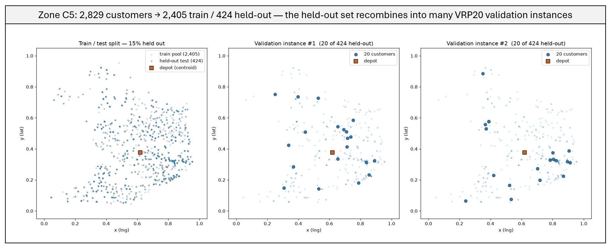
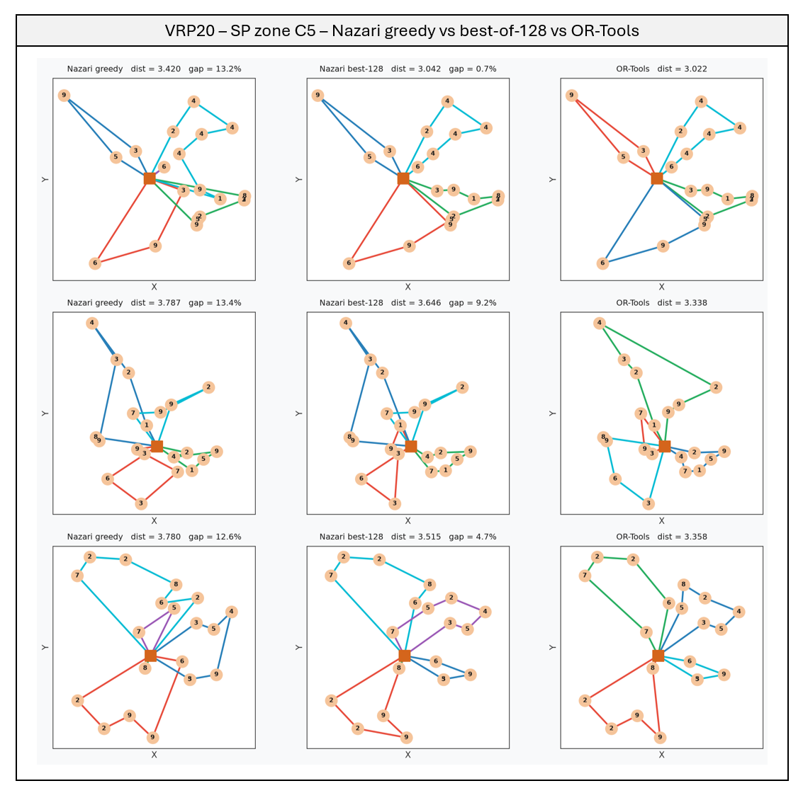
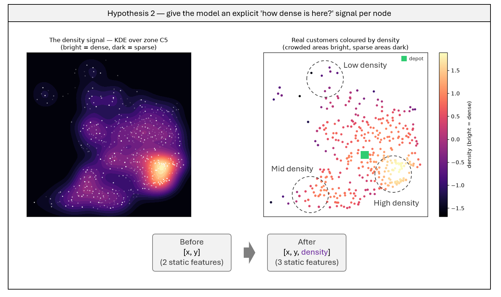
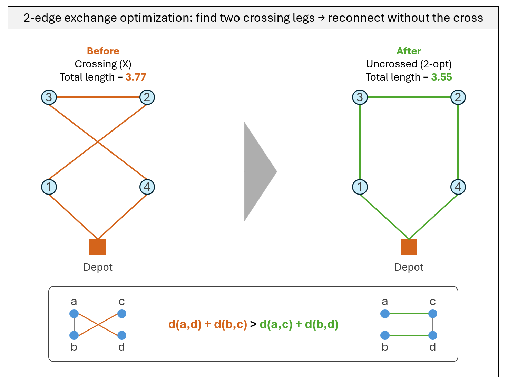
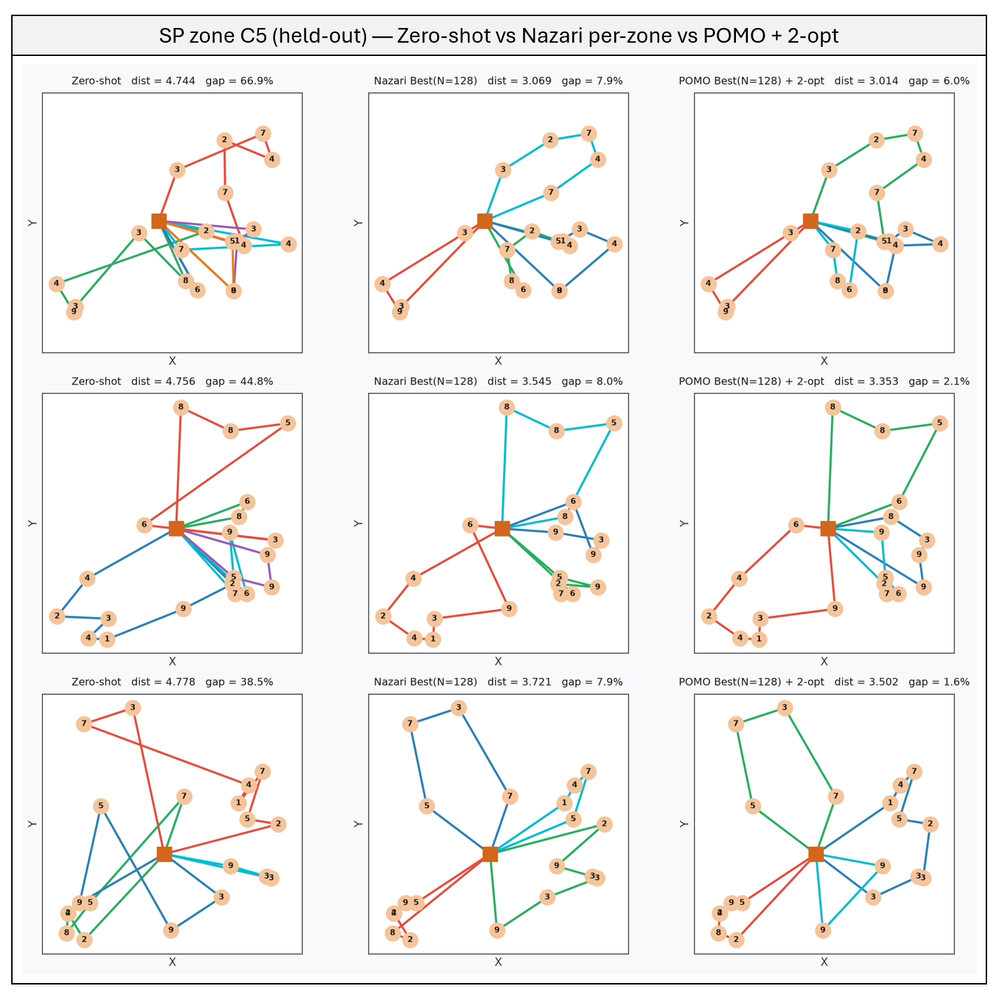

# Part II — Learning São Paulo: Per-Zone Routing

> Continuation of [Part I](README.md), which reproduced Nazari et al. (2018) and exposed the cost of distribution shift.

## The challenge of real data

Part I trained the policy on synthetic `Uniform[0,1]²` instances and then applied it **zero-shot** to real São Paulo deliveries. The gap to OR-Tools jumped from ~20% on synthetic data to **63.8% (greedy) / 26.9% (best-of-128)** on real SP zones. The diagnosis was unambiguous: the bottleneck is **distribution shift, not model capacity**. That zero-shot model is the **baseline** Part II works to beat.

Real data breaks the assumptions synthetic data hides: customers cluster along streets and centers, density varies sharply across a zone, and every zone has its own shape. Part II asks a single question — **can we close the gap by making the model learn São Paulo itself?**

## Validation frame

To keep the effort focused and every claim measurable:

- **Target zone — C5 / Centro-Sul.** We concentrate on the densest, most central zone, which is also the hardest under best-of-128 (36.6% gap). The bet: if an approach works on the hardest, most non-uniform zone, it should carry over to the easier ones.
- **Held-out benchmark.** Every number is measured on a leakage-free held-out test set — 15% of the zone's real customers, never seen in training — the *same* instances used for the Part I zero-shot baseline, so results are directly comparable.
- **A list of hypotheses.** Part II is run as a sequence of hypotheses, each a lever on a different stage of the pipeline (`data → features → learning signal → decoding`). For each, the decision taken and the alternative we discarded:

| Lever | Decision | Alternative discarded (why) | Status |
|---|---|---|---|
| **Data** | Sample real customers directly, per zone | KDE-generated instances — redundant given thousands of real points; the CV bandwidth collapses to a near-copy of the data | ✅ tested (H1) |
| **Features** | KDE **density** per node — `log p(x,y)` | Polar coordinates / distance-to-depot — derivable from the raw `(x,y)` the model already sees | ❌ rejected (H2) — hurt the model |
| **Learning signal** | POMO multi-start baseline | A learned critic — an extra network for marginal gain over a rollout baseline | ✅ tested (H3) |
| **Decoding** | Best-of-N sampling, then 2-opt | — | ✅ tested |

### The held-out benchmark, visualized

The zone's real customers are split once into a training pool and a disjoint held-out test set. Validation instances are then built by sampling 20 customers at a time from the held-out pool — the same 424 points recombine into many distinct VRP20 problems the model never trained on.

*Zone C5 — left: the train/test split (2,405 train in grey, 424 held-out in blue, depot in orange). Middle and right: two VRP20 validation instances, each 20 customers drawn from the held-out pool. The 424 held-out points recombine into many distinct instances, and the model never trains on any of them — so a good score cannot be memorization.*

---

## Hypothesis 1 — Train per zone

**Claim:** zero-shot failed because the model never saw clustered geography. The most direct fix is to **train on the target zone's own customers**, matching the training distribution to the evaluation exactly.

Three design choices make "train per zone" concrete:

- **Per-zone normalization.** Each zone's lat/lng is normalized by *its own* bounding box, so the model always sees points in `[0,1]²` framed to that zone — the identical framing the held-out eval uses. (Part I's failed KDE attempt mismatched a global frame against per-zone eval; here the frames agree by construction.)
- **Leakage-free train/test split.** 15% of the zone's customers are held out for evaluation; the model trains only on the remaining 85%. Train and test never share a customer, so a good score cannot be memorization.
- **Direct real-point sampling.** Each training instance draws 20 real customers from the train pool, with the zone centroid as the depot. With ~2,400 real points, this yields effectively unlimited distinct instances — no need to synthesize data.

### Result

| Model | Greedy gap | Best-of-128 gap |
|---|---|---|
| Zero-shot uniform (Part I baseline) | 86.0% | 36.6% |
| **Per-zone (C5)** | **14.0%** | **6.6%** |

*Zone C5 (held-out) — the per-zone model: greedy vs best-of-128 vs OR-Tools. Greedy already tracks the OR-Tools structure (~13% per instance) and best-of-128 nearly matches it (top instance within 0.7%) — a world apart from the zero-shot baseline, whose greedy routes sprawled at ~87%.*

Per-zone training alone collapses the gap — from **86% → 14%** greedy, and **37% → 7%** under best-of-128 — with no change to the model architecture. This confirms Part I's diagnosis directly: the barrier was the training distribution, not the network. Best-of-128 then lands the model within a few percent of OR-Tools, at a fraction of the runtime.

This per-zone model is the **baseline the remaining hypotheses build on.** From here on, the running result to beat is **best-of-128** (≈6.6% gap).

---

## Hypothesis 2 — Density feature (rejected)

**Motivation.** The model sees each customer's raw coordinates, but it has to *infer* how crowded each neighborhood is. What if we tell it directly? A KDE density `log p(x, y)` per node is an explicit "how dense is here?" signal. The bet: in dense clusters the model should form tight sub-tours; in sparse pockets it should accept longer legs — and making density explicit might help it make that call, especially in São Paulo, where density varies sharply within a single zone.

*Left: the KDE density field over zone C5 (bright = dense, dark = sparse). Right: the real customers coloured by that density — crowded areas show many bright points, sparse areas few dark ones. This per-customer value is the extra feature `[x, y, density]` fed to the model.*

**What we did.** Fit a KDE on the train pool (bandwidth 0.05) and attach the standardized density as a third static channel per node (fit on train, evaluated on the held-out set — no leakage). Everything else identical to H1.

**Result — rejected.** The feature *hurt* the model:

| Model | Greedy gap | Best-of-128 gap |
|---|---|---|
| H1 (no density) | 14.0% | 6.6% |
| H2 (+ density) | 52.3% | 14.6% |

**Why it likely failed.** The model already sees all 20 coordinates, so it can infer local density on its own — the extra feature adds little. It may also have hurt training: the density channel spans a wider range than the coordinates (which sit in `[0,1]`), so it can dominate the encoder input. We did not pursue a rescaled version.

---

## Hypothesis 3 — POMO: a smarter learning signal

**Claim:** the Kool baseline (a frozen greedy copy of the policy) isn't the only way to cut REINFORCE's variance. **POMO** (Kwon et al., 2020) derives the baseline from the **symmetry of the problem itself** — no frozen copy, no critic — and is known to generalize better out-of-distribution, which is exactly our concern.

**The symmetry.** A route is a cycle: `depot → A → B → C → depot` is the *same* trip whether you describe it starting from A, B, or C. So one instance has many equivalent representations — one per starting node.

**The mechanism.** For each instance, roll out **N trajectories, each forced to start from a different customer**. Their rewards `R₁…R_N` baseline *each other*: the advantage of trajectory *i* is `Rᵢ − mean(R₁…R_N)`. It's like grading students against the class average — the group calibrates itself, with no external answer key (critic) and no frozen reference (Kool).

**Why it should help here.** Lower-variance advantage from N samples of the *same* instance; the model learns to solve the zone starting from any point (more robust); and POMO transfers better to unseen instances — the whole point of the held-out benchmark.

Same Nazari model and same per-zone data as H1 — only the training loop changes (multi-start rollouts + group-mean baseline). At inference, the same N multi-starts are run and the best tour is kept.

### Result

POMO beats the Kool baseline (H1) across every decoding, on the same held-out C5 set:

| Model | Greedy gap | Best-of-128 gap |
|---|---|---|
| H1 (Kool baseline) | 14.0% | 6.6% |
| **POMO** | **11.9%** | **5.5%** |

The gain shows up in both columns (~1–2 points each), which is what makes it credible rather than sampling noise. **POMO is the best model so far** (best-of-128 at 5.5%); the decoding trick below squeezes it a little further.

---

## A little trick to finish: 2-opt

Not a hypothesis — just a cheap geometric cleanup applied on top of the best model.

**The intuition (a small mathematical trick).** Whenever two legs of a trip **cross** — form an X — you can reconnect them the other way to remove the crossing. By the triangle inequality, uncrossing is *always* shorter. Repeat until no crossing is worth undoing.

*Two crossing legs (red) reconnected without the crossing (green) — the middle segment is reversed. Uncrossing always shortens the tour (3.77 → 3.55 here).*

**When it runs.** 2-opt is applied **at planning time** — it polishes the route the model produces *before the vehicle leaves*, as part of preparing the plan. It is **not** a correction made after the visits are driven. (In the weekly-batch SP setting every stop is known up front, so the whole route is planned and cleaned before dispatch.)

**Effect on both models.** 2-opt helps regardless of which model produced the route — it cleans up whatever crossings the policy left behind:

| Model | best-of-128 | best-of-128 + 2-opt |
|---|---|---|
| H1 (Kool baseline) | 6.6% | 4.7% |
| **POMO** | **5.5%** | **3.8%** |

It shaves ~1.7–1.9 points off each model, and the ordering holds: POMO stays ahead of H1 after the cleanup.

---

## The whole story, one table

How the gap to OR-Tools shrank at each step, from the Part I zero-shot baseline to the final polished model. Every row is measured on the **same 32 held-out VRP20 instances** of zone C5 (customers never seen in training):

| Step | Lever | Greedy gap | Best-of-128 gap |
|---|---|---|---|
| Zero-shot uniform (Part I baseline) | — | 86.0% | 36.6% |
| Hypothesis 1 — train per zone | Data | 14.0% | 6.6% |
| Hypothesis 3 — POMO baseline | Learning signal | 11.9% | 5.5% |
| POMO + 2-opt | Decoding | — | **3.8%** |

*Hypothesis 2 (density feature) is omitted — it was tested and rejected (it hurt the model), so it is not part of the improvement path.*

From **36.6% → 3.8%** on the hardest zone, without ever changing the model architecture: the wins came from the training distribution (H1), the learning signal (POMO), and a cheap geometric cleanup (2-opt). Final result: **3.8% from OR-Tools**, at a fraction of its runtime.

*Zone C5 (held-out) — the same three instances routed by each stage of the progression. Left: the zero-shot uniform model sprawls with crossing legs (~40–67% gap). Middle: the per-zone Nazari model, best-of-128 (~8%). Right: POMO best-of-128 polished with 2-opt (1.6–6.0%). Node labels are customer demands; the square is the depot.*