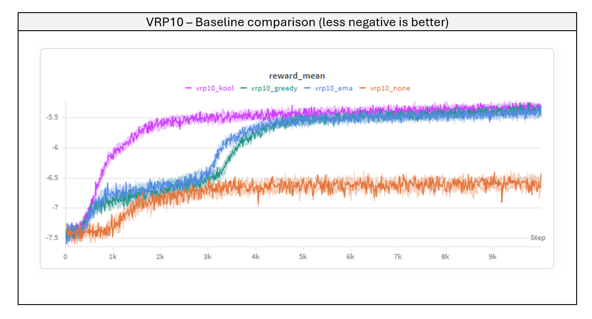
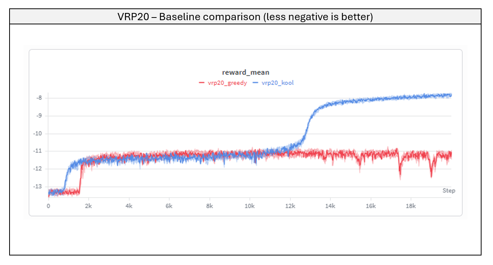
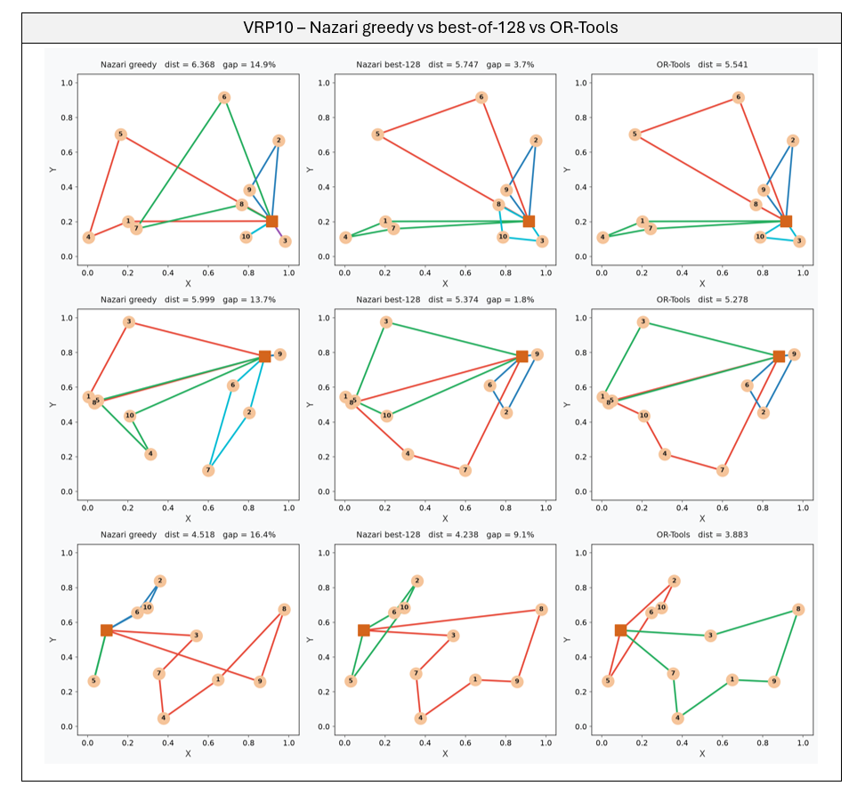
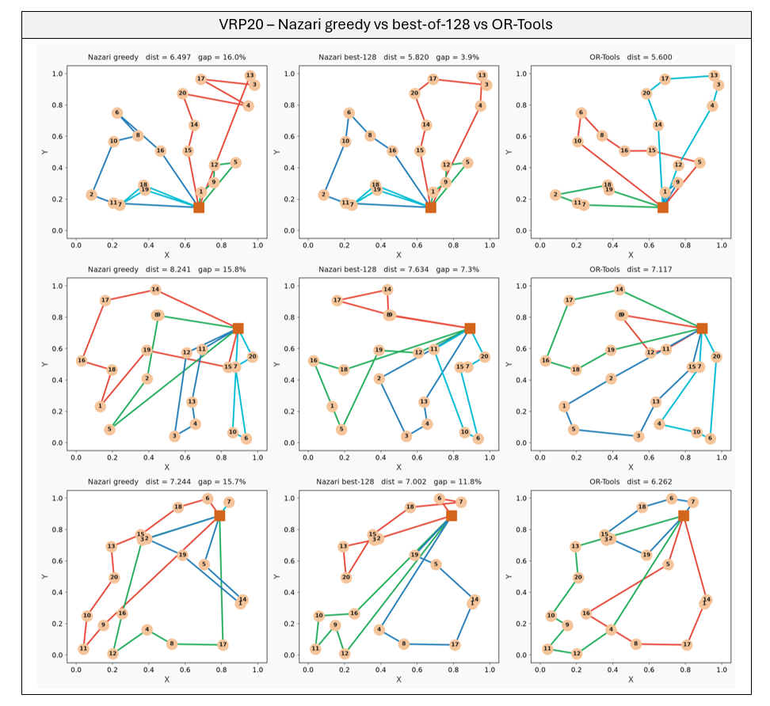
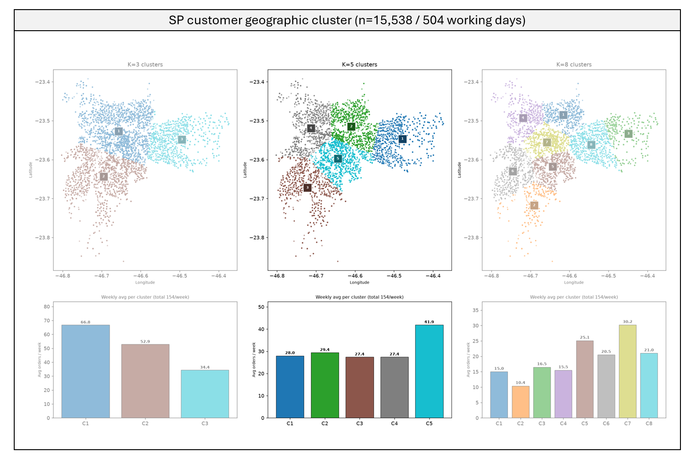
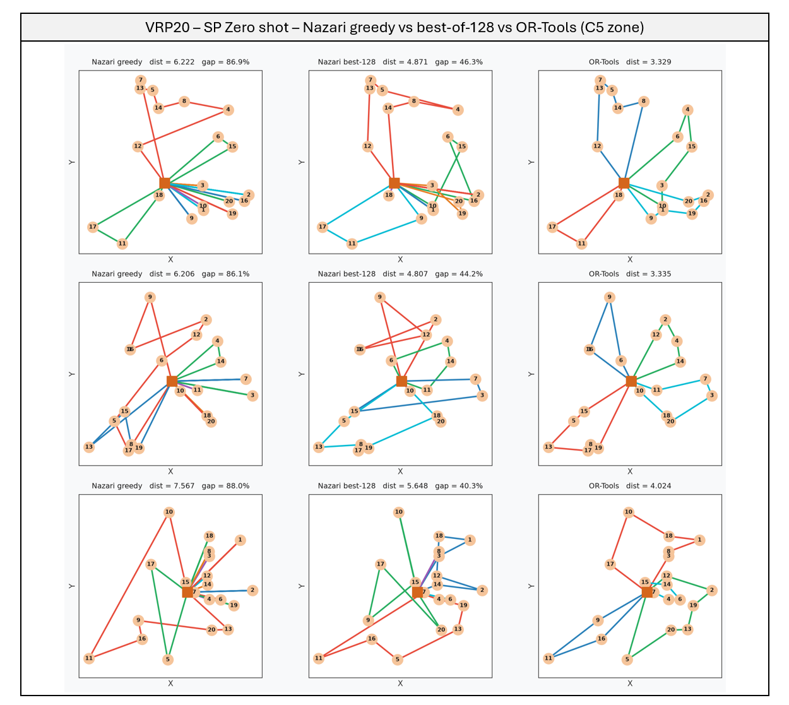

# Reproducing Nazari et al. (2018): Attention-Based Routing with REINFORCE

The Capacitated Vehicle Routing Problem (CVRP) asks: given a depot and N customers — each with a location and demand — find the shortest set of routes for vehicles with capacity Q that serves everyone exactly once. With 20 customers the search space exceeds 10¹⁷ candidate solutions. Classical solvers work by pruning that space; learned heuristics try to shortcut it entirely.

The project has two parts. **Part I** (this document) reproduces the attention-based policy from [Nazari et al. (2018)](refs/1802.04240v2.pdf) end-to-end — model architecture, REINFORCE training loop, and baseline variants — tests it on two problem sizes (VRP10 and VRP20), and ends with a zero-shot evaluation on real São Paulo delivery data (Olist dataset). **Part II** (upcoming) attacks the distribution shift that the zero-shot test exposes, by training per-zone on real SP customers.

---

## Part I — Reproducing Nazari on Synthetic CVRP

*Train on synthetic Uniform[0,1]² instances, benchmark against OR-Tools, then stress-test with a zero-shot transfer to real São Paulo data.*

### Step 1 — VRP10: Which Baseline Works?

The model is a stochastic policy over customer visit sequences trained with REINFORCE. The only design knob tested here is the **variance-reduction baseline** — the reference value subtracted from the sampled reward to compute the advantage signal. Four variants were trained on VRP10 under identical conditions:

- **No baseline:** vanilla REINFORCE — full reward variance, no reduction
- **EMA:** exponential moving average of past rewards (α = 0.99)
- **Greedy:** the current model's own deterministic tour
- **Kool:** a frozen copy of the model, updated only when a paired t-test confirms the current policy is significantly better (α = 0.05)



*W&B training curves — reward_mean over 10,000 epochs (less negative = better, since reward = −tour length).*

| Baseline | Nazari mean | OR-Tools mean | Gap% (greedy) | Gap% (best-128) |
|---|---|---|---|---|
| No baseline | 8.69 | 4.73 | 84.7% | 15.1% |
| EMA | 5.41 | 4.73 | 14.8% | 4.8% |
| Greedy | 5.34 | 4.73 | 13.1% | 4.1% |
| Kool | 5.50 | 4.73 | 17.1% | 4.3% |

*Gap% (greedy): argmax decoding. Gap% (best-128): sample 128 tours per instance, keep the shortest.*

At VRP10 the problem is small enough that greedy and Kool converge to near-identical quality — the difference between 13% and 17% greedy gap is within sampling noise (32 instances). No baseline is the clear outlier, stuck at 85%. EMA, Greedy, and Kool all reach viable solutions. Sampling 128 tours and keeping the best roughly **quartered every gap** — EMA/Greedy/Kool all land at ~4–5%, and even the no-baseline model recovers from 85% to 15%. This is the first hint that greedy decoding leaves a lot on the table at inference time.

---

### Step 2 — VRP20: Where Greedy Fails

Scaling to VRP20 is where the baseline choice stops being a tuning decision and becomes architectural.



*W&B training curves — reward_mean over 20,000 epochs. Greedy plateaus; Kool shows the characteristic phase transition at ~12,000 epochs.*

| Baseline | Nazari mean | OR-Tools mean | Gap% (greedy) | Gap% (best-128) |
|---|---|---|---|---|
| Greedy | 17.63 | 6.25 | 179.4% | 47.0% |
| Kool | 7.43 | 6.25 | 19.5% | 8.9% |

*Gap% (greedy): argmax decoding. Gap% (best-128): sample 128 tours per instance, keep the shortest.*

With best-of-128 sampling, Kool drops from 19.5% to **8.9%**. The collapsed greedy baseline recovers to 47% — better, but sampling cannot rescue a degenerate policy: if the underlying distribution is bad, drawing 128 samples from it still gives bad tours.

The greedy baseline collapses at VRP20. Because the policy and baseline share the same weights, as soon as the model improves the baseline improves equally — the advantage signal zeroes out and learning stops at a degenerate solution (179% gap, worse than random routing). Kool's frozen copy keeps the advantage alive. The training curve shows the characteristic Kool pattern: a long flat phase followed by a sharp drop at ~12,000 epochs when the frozen baseline is finally updated, allowing the gradient to propagate fully.

---

### Masking: Enforcing Feasibility

The model is an autoregressive policy — it selects the next node to visit one step at a time, with no explicit lookahead. Left unconstrained, it would quickly learn degenerate behaviors. Three masking rules enforce feasibility at every step:

**Rule 1 — Already-served customers are masked.** Once a customer's demand reaches zero it is removed from the action space. Without this, the model could revisit the same node repeatedly to accumulate zero-cost moves.

**Rule 2 — Customers that exceed remaining vehicle capacity are masked.** If the vehicle has 0.1 capacity left and a customer needs 0.3, that customer is hidden. The vehicle must return to the depot to reload before serving it.

**Rule 3 — Depot is masked when the vehicle is already at the depot and customers remain.** This is the most consequential rule. Without it, the model quickly learns a pathological policy: stay at the depot indefinitely. A vehicle that never leaves accumulates zero travel distance — which looks like a perfect reward signal during early training until the episode never terminates. Masking the depot whenever the vehicle is there and at least one customer is reachable forces the policy to leave and serve.

The exception to Rule 3: if all remaining customers exceed the vehicle's current capacity (none are reachable), the depot must stay unmasked — otherwise the model deadlocks with no valid action. In that case the vehicle returns to reload, and the full customer set becomes reachable again.

These three rules together make the RL problem tractable: the model only ever chooses between genuinely valid next stops, and the reward signal (negative total distance, given only when all customers are served and the vehicle is back at the depot) is always reachable.

---

### Inference Time: Speed vs. Quality

The core trade-off of learned heuristics is explicit here. OR-Tools is a general-purpose combinatorial solver given up to 30s per instance; Nazari runs the entire batch in a single forward pass.

| Problem | Nazari (greedy) | OR-Tools (GLS) | Speedup |
|---|---|---|---|
| VRP10 | ~2 ms/instance | ~5 s/instance | ~2,500x |
| VRP20 | ~8 ms/instance | ~30 s/instance | ~3,700x |

*Nazari runs as a batch of 32 on CPU; OR-Tools runs sequentially with a 30s time limit.*

A 19.5% longer tour in exchange for a 3,700x faster solve. For operations where hundreds of routing decisions are made in real time — dispatch systems, dynamic re-routing, simulation — this trade-off is often worth it.

### Route Comparison

Three instances per problem size (closest to the median greedy gap), each shown three ways: **Nazari greedy** (left), **Nazari best-of-128** (middle), and **OR-Tools** (right).



*VRP10 — greedy vs best-of-128 vs OR-Tools. A single vehicle makes multiple trips from the depot; each color is one trip before returning to reload (depot = orange square). Best-of-128 visibly tightens the greedy routes toward the OR-Tools solution — the self-crossings (the X within a single trip) that appear under greedy largely disappear.*



*VRP20 — greedy vs best-of-128 vs OR-Tools. A single vehicle makes multiple trips from the depot (each color is one trip before returning to reload). With 20 customers the structural differences become visible. A recurring pattern in the **greedy** solutions is route crossing — within a single trip, the path crosses itself forming an X, a clear sign of suboptimality. Sampling 128 tours and keeping the shortest removes many of these crossings, moving toward OR-Tools, which routes cleanly along perimeters. The model has no per-tour guarantee against crossings because it selects customers one at a time without lookahead into whether future stops will require backtracking.*

---

### Zero-Shot on São Paulo

The model was trained entirely on synthetic instances with customer coordinates drawn from Uniform[0,1]². Applying `vrp20_kool` directly to real delivery addresses in São Paulo — no retraining — quantifies the cost of distribution shift.

The Olist Brazilian E-Commerce dataset (2016–2018) provides 15,538 SP orders with customer geolocation resolved via postal code prefix. Before running any model, three questions needed answers from EDA: **what is each customer's demand?**, **how many customers per route?**, and **how many zones?**

**Demand mapping.** Each order has an associated product weight (from the items and products tables). Orders above 20kg were excluded — the practical hard limit for SP motoboy deliveries — removing 177 orders (1.1%), leaving **15,222** for modeling. The remaining weights (50g–20kg) were mapped to integer demand values [1–9] via quantile binning: nine equal-frequency bins so that each demand level represents an equal share of the order distribution, with average demand ≈ 5. The model sees demand normalized by vehicle capacity (Q=30), so each customer occupies between 3.3% and 30% of a vehicle — matching the normalized range the model was trained on.

**Why VRP20.** The dataset spans roughly 500 working days. Spread over that period, São Paulo averages ~24 orders/day — roughly one VRP10-sized delivery per day. But a more realistic e-commerce model batches orders across the week rather than dispatching daily: same-week orders accumulate and go out in a single delivery run. Weekly batching brings the per-zone scope to **28–42 orders/week**, putting VRP20 squarely in range as the problem size.

**Why K=5.** K-means was tested for K=3, 5, and 8. K=5 was selected because it produces the most balanced zones: each cluster contains between 2,520 and 4,075 customers (17–27% of total), with weekly volumes of 28–42 orders — close enough to VRP20 scope across all zones. K=3 produces one oversized zone exceeding 60 orders/week; K=8 fragments the city into zones too small to justify separate routing operations. K=5 also aligns naturally with how São Paulo is traditionally divided: the city has five well-known administrative zones — Norte, Sul, Leste, Oeste, and Centro — and the K-means clusters recover a similar partition from the data alone.

For each of the 5 clusters, 32 VRP20 instances were sampled from a **held-out test set** — 15% of the zone's real customers, set aside from everything else — with lat/lng normalized per-cluster bounding box and the cluster centroid as depot. The uniform model never saw any SP customer, so every instance is unseen regardless; fixing a held-out benchmark keeps this zero-shot measurement on exactly the same instances used by later experiments.



| Cluster | Nazari mean | OR-Tools mean | Gap% (greedy) | Gap% (best-128) |
|---|---|---|---|---|
| C1 (Leste) | 5.473 | 3.557 | 54.4% | 21.2% |
| C2 (Norte) | 5.435 | 4.136 | 31.5% | 15.8% |
| C3 (Sul) | 6.255 | 3.358 | 90.1% | 34.0% |
| C4 (Oeste) | 5.054 | 3.260 | 57.0% | 27.2% |
| C5 (Centro-Sul) | 6.356 | 3.429 | 86.0% | 36.6% |
| **Overall** | **5.715** | **3.548** | **63.8%** | **26.9%** |

*Nazari mean is the greedy tour length. OR-Tools given 10s per instance.*

The gap jumps from 19.5% on synthetic uniform instances to **63.8%** on real SP data (greedy). São Paulo's spatially clustered geography is structurally different from Uniform[0,1]² — the model learned efficient routing for scattered customers and struggles with dense intra-cluster routing. Best-of-128 sampling roughly halves the gap (to **26.9%**), but cannot close it: sampling only explores tours from a policy that never saw clustered data, so the ceiling is set by the distribution mismatch, not by the decoding. Closing this gap properly requires training on the target distribution — the subject of Part II.



*Zero-shot on real SP data (zone C5, held-out) — the uniform `vrp20_kool` model: greedy vs best-of-128 vs OR-Tools. Greedy routes sprawl with long crossings (~87% gap); best-of-128 tightens them (~44%) but the policy never learned São Paulo's dense structure, so both stay far from OR-Tools. This distribution mismatch — not model capacity — is the gap Part II sets out to close.*

---

### Part I — Takeaways

- **The variance-reduction baseline is load-bearing, not a tuning knob.** At VRP10 every baseline works; at VRP20 the greedy baseline collapses to 179% (worse than random) while Kool holds at 19.5%. The choice becomes architectural as the problem scales.
- **Decoding is half the battle.** Best-of-128 sampling roughly quarters the greedy gap for free at inference (VRP10 ~4%, VRP20 8.9%) and removes the self-crossings greedy leaves behind — no retraining, still thousands of times faster than OR-Tools.
- **Learned heuristics buy speed at a controllable quality cost.** ~2,500–3,700× faster than OR-Tools at a modest gap — the right trade for real-time or high-throughput routing.
- **Zero-shot on real data fails, and the cause is distribution shift.** On São Paulo the gap jumps to 63.8% greedy / 26.9% best-128. Sampling can't rescue it because the policy never saw clustered geography — the ceiling is set by the training distribution, not by model capacity or decoding. **This is exactly what Part II addresses.**

---

## Part II — São Paulo

📄 **[Read Part II → Learning São Paulo: Per-Zone Routing](PART_II.md)**

Part I isolated the bottleneck — distribution shift, not model capacity. Part II attacks it by training on the target distribution directly:

- **Per-zone training:** train a separate model per zone on that zone's real customers, with a leakage-free train/test split, so the training distribution matches the eval exactly.
- **Decoding & local search:** best-of-N sampling and 2-opt post-processing to push the learned policy closer to optimal.
- **Scaling:** larger instances (VRP50 and beyond).

---

## Pipeline

```
eda/01_volume_analysis.py           → SP order volume, daily scope
eda/02_geographic_distribution.py   → K-means zones, weekly volume per cluster
eda/03_demand_analysis.py           → Weight distribution, demand mapping [1–9]
eda/04_build_instances.py           → VRP20 instance generation from real SP data
eda/05_split_train_test.py          → Per-zone train/test split, held-out eval (Part II)

scripts/train_kaggle.py             → VRP10/20 training — all baseline variants (Kaggle T4)

scripts/eval_sp.py                  → Zero-shot + OR-Tools eval on SP instances
scripts/eval.py                     → Eval against OR-Tools on synthetic instances
```

---

## Acknowledgements

All model training was done on **NVIDIA Tesla T4 GPUs** provided free of charge by [Kaggle](https://www.kaggle.com). Without Kaggle's free GPU quota this project would not have been feasible.
